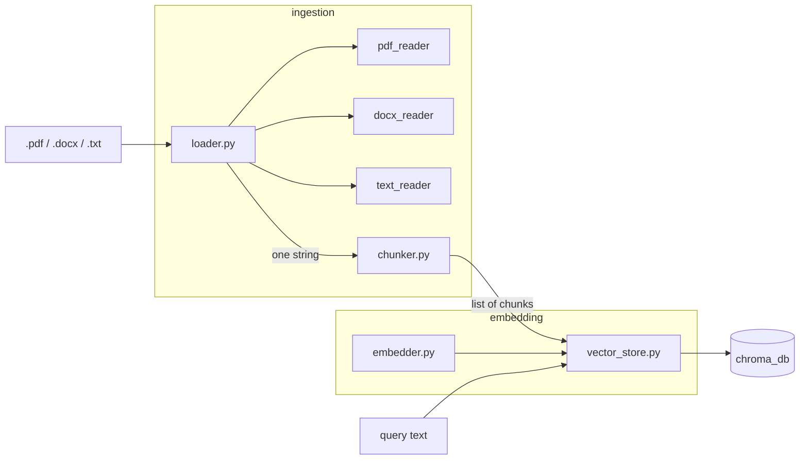

# F-RAG PROJECT DOCUMENTATION  
Volodymyr Hryshko  
Computer Science, IFE

### The following is the detailed progress made over the course of summer semester (2026) for the IPS project

### The earlier development achievements can be observed on this [GitHubRepo](https://github.com/JayAlvn/Fraud-Detection-RAG-Pipeline-FRAG-)

## 20.03.2026

Building out the first half of a RAG pipeline:
**ingest** → **chunk** → **embed** → **store/search** in Chroma.

