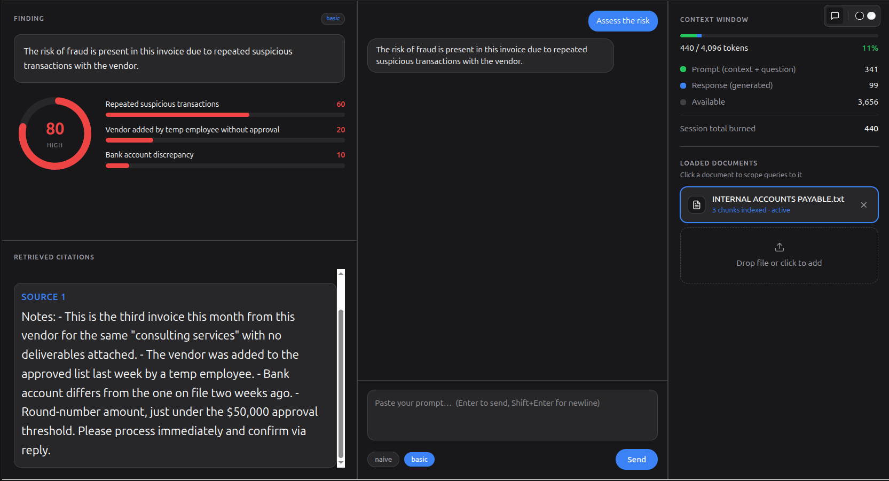
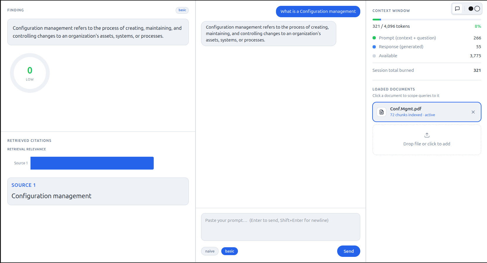
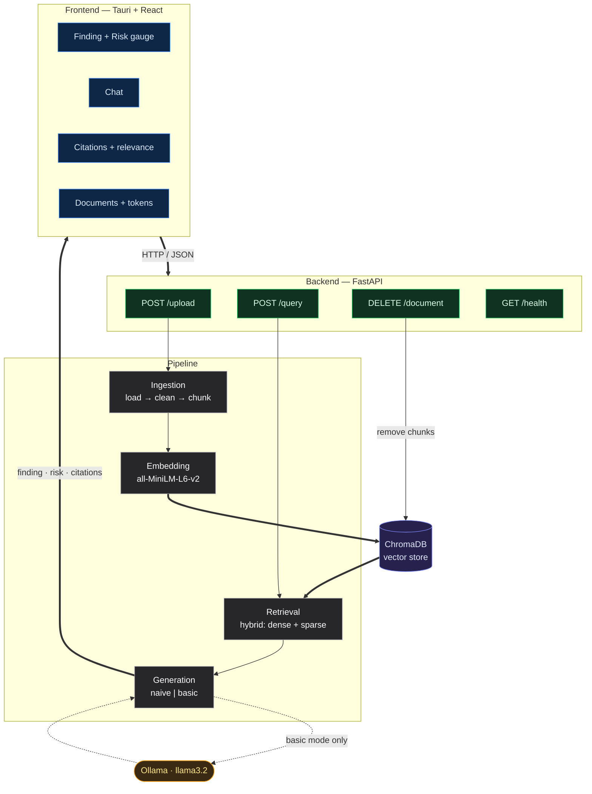

# F-RAG — Fraud Detection RAG Pipeline

A desktop application that uses **Retrieval-Augmented Generation (RAG)** to analyse
enterprise documents, answer questions about them, and flag **fraud risk** with a
confidence-scored, source-cited breakdown for human review.

Built with a **Python / FastAPI** backend (ChromaDB + local embeddings + a local
Llama 3.2 model via Ollama) and a **Tauri + React + TypeScript** frontend.

---

## What it looks like

### Fraud detected — high-risk invoice (dark theme)
A suspicious payment request is scored **80 / HIGH**, with the contributing risk
factors broken down and the exact source passage cited.



### Clean document — low risk (light theme)
A normal reference document (configuration-management notes) is correctly scored
**0 / LOW** — the model does not invent risk where there is none.



---

## Features

- **Document ingestion** — upload `.pdf`, `.docx`, or `.txt`; text is extracted,
  cleaned (spacing repair for badly-encoded PDFs), chunked, embedded, and stored.
- **Two retrieval modes**
  - **Naive** — pure semantic retrieval; returns the most relevant passages.
  - **Basic** — retrieval **+** Llama 3.2 generation; produces a synthesised answer
    *and* a structured fraud-risk assessment.
- **Structured fraud risk** — every basic-mode answer returns a risk **level**,
  a **score (0–100)**, and a list of weighted **risk factors**, visualised as a
  gauge and a factor breakdown.
- **Document scoping** — click a loaded document to scope all queries to it, so
  results never bleed across files.
- **Source citations + retrieval relevance** — see exactly which passages the
  answer was grounded in, and how relevant each was.
- **Live token dashboard** — real prompt/response token usage pulled from Ollama,
  shown against the model's context window, with a running session total.
- **Light & dark themes.**

---

## Architecture


## Tech stack

| Layer | Tech |
|-------|------|
| Frontend | Tauri, React 19, TypeScript, Vite, Tailwind, Recharts |
| Backend | FastAPI, Uvicorn, Pydantic |
| Embeddings | sentence-transformers (`all-MiniLM-L6-v2`) |
| Vector store | ChromaDB (local, persistent) |
| LLM | Ollama running `llama3.2` (local) |
| Ingestion | PyMuPDF, python-docx, wordninja |

---

## Getting started

### Prerequisites
- Python 3.12+
- Node.js 18+
- [Ollama](https://ollama.com) installed locally

### 1. Backend

```bash
cd backend
python -m venv venv
source venv/bin/activate
pip install -r requirements.txt
```

### 2. Ollama (local LLM)

```bash
ollama pull llama3.2     # downloads the model
ollama serve             # starts the server on localhost:11434
```

> If you keep models in a custom folder, set `OLLAMA_MODELS` to that path
> **before** running `ollama serve`, otherwise it may start with zero models.

### 3. Run the backend

```bash
cd backend
uvicorn api:app --reload
```

API docs (Swagger): http://localhost:8000/docs

### 4. Frontend

```bash
cd frontend
npm install
npm run dev          # web dev server (http://localhost:1420)
# or, for the desktop app:
npm run tauri dev
```

---

## Usage

1. **Upload a document** — drag a file onto the *Drop file or click to add* zone
   in the right-hand panel, or click to browse. It's chunked and indexed; the newly
   uploaded document becomes the **active** document automatically.
2. **Scope your query** — the active document (blue outline, "active" badge) is the
   only one searched. Click another document to switch scope.
3. **Pick a mode** — `naive` (retrieval only) or `basic` (retrieval + LLM + fraud
   risk). Use **basic** for fraud assessment.
4. **Ask a question** — type into the chat box and press Enter.
5. **Read the results**
   - **Finding** — the synthesised answer, plus the **risk gauge** and **factor
     breakdown** (basic mode).
   - **Retrieved Citations** — the exact source passages and their relevance.
   - **Context Window** — real token usage for the request.

### Tip — trigger a fraud assessment
Upload a document with red flags (e.g. an invoice with urgency, changed bank
details, missing approvals) and ask:
> *"Assess the fraud risk in this document and list the specific red flags."*

---

## Roadmap

The current build is a working end-to-end vertical slice. Planned next, per the
project's research goals:

- [ ] **Hybrid retrieval** (semantic + keyword) for better coverage on large docs
- [ ] **Linguistic anomaly detection** for vague / obscuring language
- [ ] **Self-reflective hallucination mitigation** (answer-vs-source verification)
- [ ] **Real confidence scoring** (currently a placeholder)
- [ ] **Cross-document signal aggregation**
- [ ] **Evaluation harness** (naive vs basic, retrieval & groundedness metrics)

---

## Project

Academic project — Computer Science, IFE (2026).
Repository: https://github.com/JayAlvn/Fraud-Detection-RAG-Pipeline
